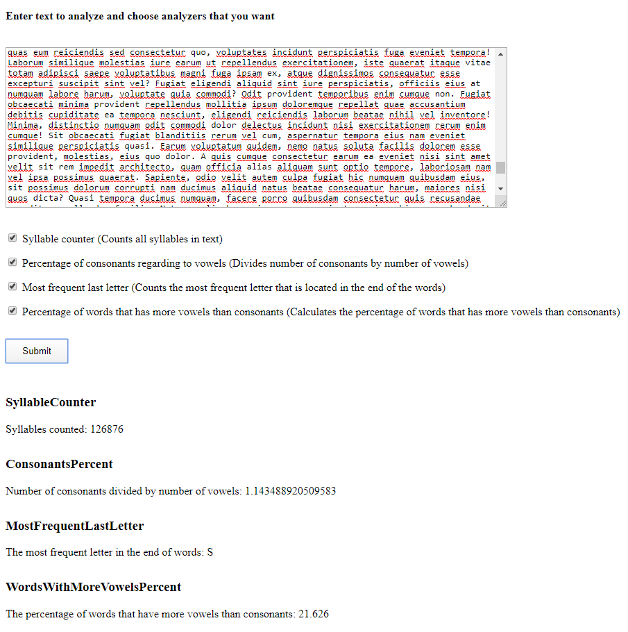

# TextAnalyzer
TextAnalyzer is web application for anylyzing text :)
To add your own analyzer just inherit it from TextAnalyzer.Interfaces.IAnalyzer interface and implement readonly name AnalyzerName 
(better to use your class name), additional message AdditionalMessage that will be shown on client side after analyzing text
and AnalyzeMetric method that analyzes text and return metric value. Then add it to DI using 
TextAnalyzer.Services.ServiceConfigurations. On the client side you have to add Analyzer variavle with name, serverName and description
in analyzers.ts file.
That's all.  

